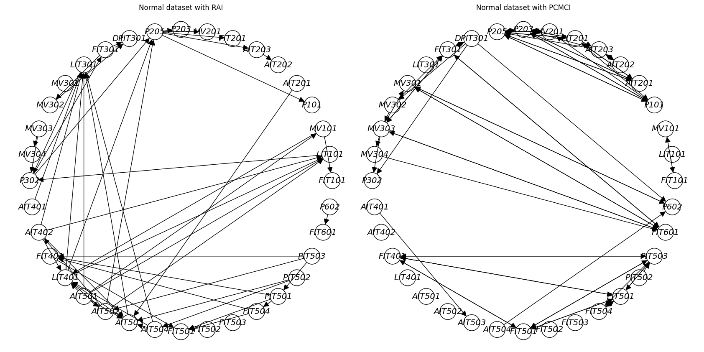
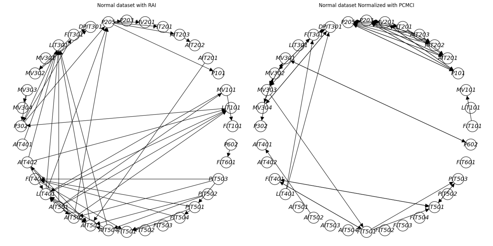
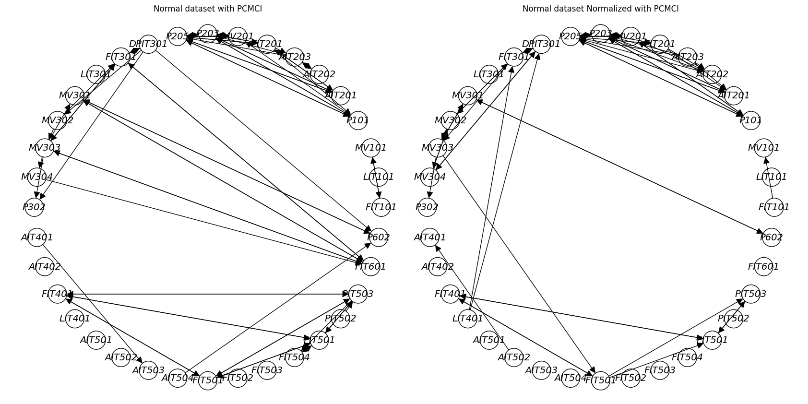

# XAI Project - RAI algorithm on SWAT dataset
---
# Causality Lab

This repository contains research code of novel causal discovery algorithms developed at Intel Labs, as well as other common algorithms, 
and classes for developing and examining new algorithms for causal structure learning.


## Table of Contents


- [Installation](#installation)
- [RAI implementation on SWAT dataset](#rai-implementation-on-swat-dataset)
   - [Comparison of RAI with PCMCI (using Tigramite)](#comparison-of-rai-with-pcmci-using-tigramite)
      - [RAI vs PCMCI (non-normalized data)](#rai-vs-pcmci-non-normalized-data)
      - [RAI vs PCMCI (normalized data)](#rai-vs-pcmci-normalized-data)
   - [Comparison of RAI with normal and attack dataset](#comparison-of-rai-with-normal-and-attack-dataset)
   - [Comparison of PCMCI with normalized data and non-normalized data](#comparison-of-pcmci-with-normalized-data-and-non-normalized-data)
- [Authors](#authors)

# Installation
Install conda env:

```console
  $ conda create --name <env> --file requirements.txt
```
after that you have to clone the [Tigramite](https://github.com/jakobrunge/tigramite.git) repository and install it on your conda env with the following command:

```console
  $ python setup.py install
```

Now go inside `notebooks\swat_dset\swat_csv` folder and unzip the `swat_dset.zip` file.


# RAI implementation on SWAT dataset

In this section, we will demonstrate the implementation of the Recursive Autonomy Identification (RAI) algorithm on the SWAT dataset. The SWAT dataset is a real-world dataset that contains data from a water treatment plant. The goal is to learn the causal relationships between the variables. The dataset is available in the `notebooks\swat_dset\swat_csv` folder.

In [This notebook](notebooks/rai_pcmci_with_swat.ipynb) we implement the RAI algorithm. We first preprocess the data from normal dataset and normalize it from 0 to 3 beacuse the RAI algorithm works with integer values then  we search for threshold bdeu values that give the best results at the end we run the RAI algorithm on the SWAT dataset and plot the results. 

### Comparison of RAI with PCMCI (using Tigramite)

Also in same notebook we compare the results of the RAI algorithm with the PCMCI algorithm using the Tigramite library. For PCMCI we use both the normalizing and non-normalizing versions of the data. We then compare the results of the RAI algorithm with the PCMCI algorithm using the Hammind distance. 

#### RAI vs PCMCI (non-normalized data)

#### Hamming distance
```
15 edges in common 
53 edges exist only in PCMCI  
38 edges exist only in RAI
```

#### RAI vs PCMCI (normalized data)

#### Hamming distance 
```
11 edges in common 
44 edges exist only in PCMCI  
42 edges exist only in RAI
```
### Comparison of RAI with normal and attack dataset

We also compare the results of the RAI algorithm with the normal and attack datasets. The attack dataset is a dataset that contains data from a water treatment plant with attacks. The dataset is available in the `notebooks\swat_dset\swat_csv` folder.

#### RAI Normal vs RAI Attack

#### Hamming distance 
```
6 edges in common 
74 edges exist only in RAI Attack  
47 edges exist only in RAI Normal
```
### Comparison of PCMCI with normalized data and non-normalized data

A comparison of the PCMCI algorithm with the normalizing and non-normalizing versions of the data is also made to see the effect of normalization on the results.

#### PCMCI(normalized) vs PCMCI(non-normalized)

#### Hamming distance
```
39 edges in common 
16 edges exist only with int and normalized values 
29 edges exist only with float values 
```
## Authors

- [@albertocaporusso](https://github.com/albertocaporusso)
- [@enricozorzi](https://github.com/enricozorzi)

